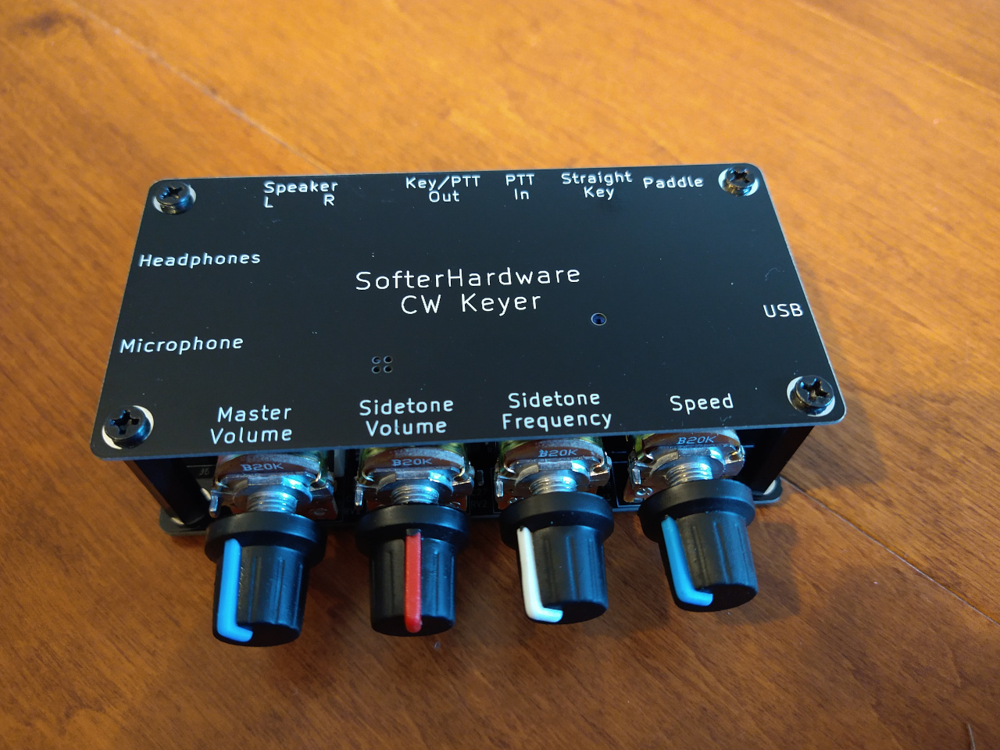

# CW Keyer for the Hermes-Lite and other SDR software

This project is a CW keyer for amateur radio. The hardware connects to a PC with USB. It then appears as an audio device for radio sound output and microphone input. It is also a Midi device to signal key up/down to the PC software, and a serial device for a connection to logging or other software on the PC. It is designed for the [Hermes-Lite 2.0](http://www.hermeslite.com/) or other SDR software. The radio sound is sent to the keyer and the keyer generates a sidetone, mixes it with the audio and sends it to the headphones or speaker. The sidetone has zero delay and is suitable for high speed CW. The keyer can also be used with a regular analog radio by using the key and PTT outputs. This project is currently a DIY project with instructions below for those who feel comfortable with some light soldering and Arduino programming.

## Hardware

The hardware consists of a carrier board as shown below and a [Teensy 4](https://www.pjrc.com/teensy/) microcontroller.
The Teensy can be purchased from [Teensy](https://www.pjrc.com/store/teensy40.html) or from [sparkfun](https://www.sparkfun.com/), [adafruit](https://www.adafruit.com/), [mouser](https://www.mouser.com/), [digikey](https://www.digikey.com/) or [amazon](https://www.amazon.com/). Make sure to order the Teensy 4.

## Software

Keyer software must be loaded into the Teensy 4 microcontroller. The Teensy 4 is programmed via a usb connection to a host computer. First, download and install the Teensy loader application for your operating system as described on [this page](https://www.pjrc.com/teensy/loader.html). Then start the teensy application. Press the programming button on the Teensy and the teensy app will change to show a picture of the board. Then select the ".hex" program file, select "program" and then "reboot".

There are currently two keyer programs available, the [hasak](./firmware/hasak/hasak.TEENSY40@600.hex) and the [TeensyWinkeyEmulator](./firmware/TeensyWinkeyEmulator/TeensyWinkeyEmulator.ino.TEENSY40.hex). Right click one or the other, select "Save link as" and download the hex file. Use it to program the Teensy.

## Ctrlr

TBD: Basic description, download and use instructions for Ctrlr MIDI control panel.

## Software Development

To write your own keyer software or to contribute to software development first clone this repository.
This git repository uses several submodules to collect various projects into a single repository. You must initialize submodules when intially cloning:

git clone --recurse-submodules git@github.com:softerhardware/CWKeyer.git

After that, also be sure to pull updates from submodules:

git pull --recurse-submodules

You can find more details about how to work with git submodules on the internet.

### Teensy Libraries

Current development is done using [Arduino IDE 1.8.19](https://www.arduino.cc/en/software) and [Teensyduino 1.56](https://www.pjrc.com/teensy/td_download.html). Please make sure those are installed.

Updated libraries are required for glitchless 48kHz audio with the CW keyer hardware. These libraries are provided in this git repository. An easy way to use these libraries is to add symbolic links to the new libraries from the arduino IDE install. This is described below for Linux and MacOS systems.

Be sure to select the "Teensy 4.0" board in the Tools-->Boards-->Teensiduino menu, and to select the "Serial + Midi + Audio" USB model in the Tools-->USB type menu,
otherwise compilation will fail.

Install teensy  library update for linux:
-----------------------------------------

 1. cd arduino-1.8.19/hardware/teensy/avr
 2. rm -rf cores   (This must be removed or moved outside of the arduino-1.8.19 area otherwise arduino will still pickup this code)
 3. ln -s /home/shaynal/CWKeyer/libraries/teensy/cores .   (Substitute the path for your local git pull of the CWKeyer repository)
 4. cd libraries
 5. rm -rf Audio   (See step 2 comments)
 6. ln -s /home/shaynal/CWKeyer/libraries/teensy/Audio .   (See step 3 comments)
 7. ln -s /home/shaynal/CWKeyer/libraries/teensy/CWKeyerShield .   (See step 3 comments)

Install teensy library update for MacOS:
----------------------------------------

(Added by DL1YCF. Note this is best done from the "terminal" app, then this is very similar to the
linux case).

All the libraries are inside the Teensyduino "app" file bundle (which is a directory tree)
/Applications/Teensyduino.app. Locate a sub-folder called "Audio", this will point you to
the libraries for the Teensy. Normally this is located in

/Applications/Teensyduino.app/Contents/Java/hardware/teensy/avr/libraries

You can copy the "Audio" folder within that folder to a safe place (or just delete it),
and do the same to the "cores" folder one step higher, that is, the "cores" folder within

/Applications/Teensyduino.app/Contents/Java/hardware/teensy/avr

Then proceed as in the linux case, that is, add a symbolic link named "cores" in the .../teensy/avr
folder and two symbolic links called "Audio" and "CWKeyerShield" in the
.../teensy/avr/libraries folder, that point to the directories "Audio", "cores" and
"CWKeyerShield" where you have placed them after down-loading from this repository.

